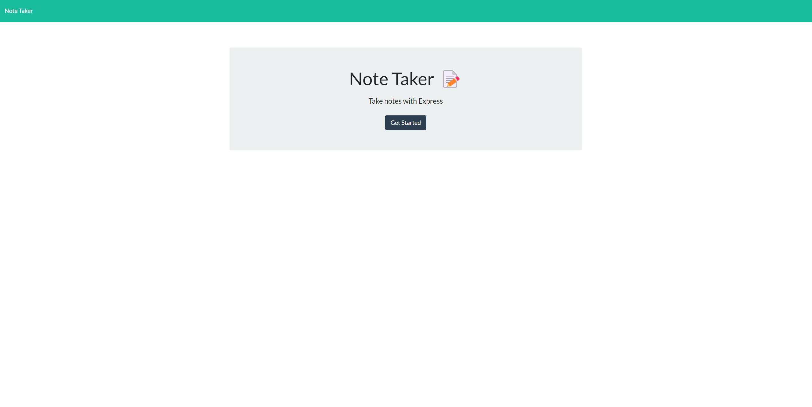
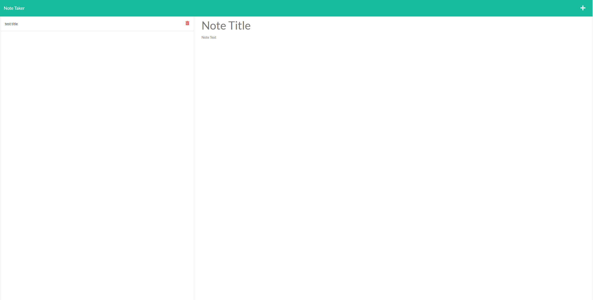

# 11 Express.js: Note Taker

## Description

 For this module we were taked with modify starter code to create an application called Note Taker that can be used to write and save notes. This application will use an Express.js back end and will save and retrieve note data from a JSON file.

The application’s front end has been given to us and It's our job to build the back end, connect the two, and then deploy the entire application to Heroku.

## Table of Contents:
- [Deployed](#deployed)
- [Installation](#installation)
- [Usage](#usage)
- [Mock-up](#mock-up)
- [Credits](#credits)

## Deployed

Click [Here](https://rocky-depths-36986.herokuapp.com/) for app deployed using heroku


## Installation

The applications dependancys will be installed by using the following command:

```bash
nmp i
```

## Usage

The applications dependancys will be installed by using the following command:
```bash
npm start
```

## Mock-up

---

---

## Credits
Software Designer: Dylan Knight

Click [HERE](https://github.com/DlonMusk) for my Github
